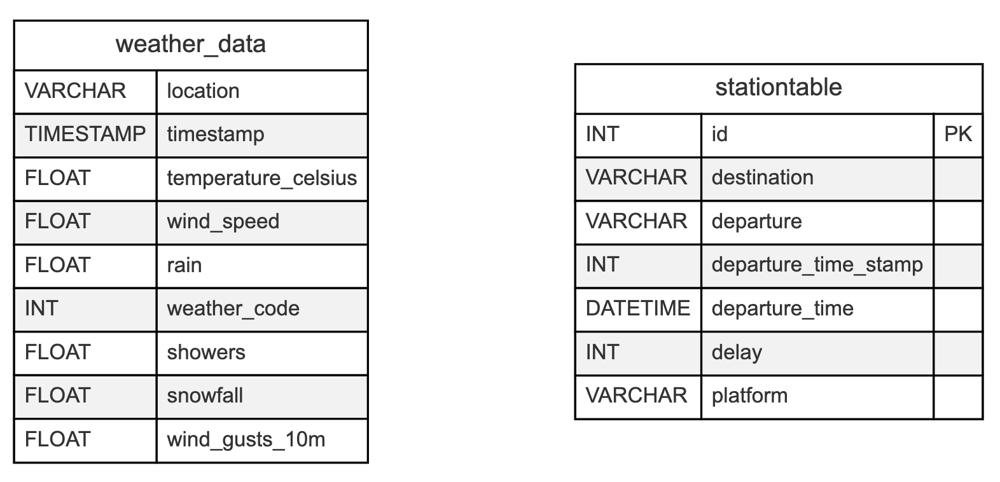

# Wetter und Verspätungen: Eine Datenreise durch Berns Bahnverkehr


Ein Projekt von:

- [@JuKa2023](https://github.com/JuKa2023)
- [@SophiaIseli](https://github.com/SophiaIseli)

Dieses Projekt untersucht den Zusammenhang zwischen Wetterbedingungen und Zugverspätungen in der Schweiz, mit Fokus auf Züge, die von Bern abfahren. Unter Verwendung von Wetterdaten der [Open-Meteo API](https://open-meteo.com/) und Zugverspätungsinformationen der [OpenTransport API](https://transport.opendata.ch/docs.html) analysieren wir, wie Wetterfaktoren wie Regen, Schnee und Wind die Pünktlichkeit der Züge beeinflussen.

Die Website präsentiert eine Datengeschichte, die die Beziehung zwischen Wetterstörungen und Zugverspätungen visualisiert. Benutzer können mit Diagrammen interagieren, die monatliche, wöchentliche oder tägliche Trends von Verspätungen und Wetterbedingungen zeigen. Wichtige Statistiken, einschliesslich der durchschnittlichen wöchentlichen verspäteten Züge, des Wetterkorrelationsprozentsatzes und der durchschnittlichen Tage mit schlechtem Wetter pro Woche, werden prominent angezeigt.

Das Hauptdiagramm ermöglicht es den Benutzern, zwischen verschiedenen Zeitauflösungen zu wechseln und bietet Einblicke in die Korrelation zwischen Wetter und Verspätungen über verschiedene Zeiträume. Zusätzlich veranschaulicht ein Streudiagramm die Beziehung zwischen einem Wetterstörungsindex und dem Prozentsatz verspäteter Züge.

Das Projekt zielt darauf ab, Benutzern zu helfen, Muster bei Zugverspätungen und deren mögliche Verbindung zu Wetterereignissen zu verstehen, und bietet wertvolle Erkenntnisse sowohl für Pendler als auch für Verkehrsplaner.

## Features

1. Datenerfassung und -verarbeitung:
   - Echtzeit-Wetterdaten via Open-Meteo API
   - Zugverspätungsdaten durch OpenTransport API
   - Speicherung in MariaDB für effiziente Analyse

2. Datenanalyse und API:
   - PHP-basierte API zur Aggregation von Wetter- und Zugdaten
   - Berechnung von Statistiken (z.B. durchschnittliche Verspätungen, Wetterkorrelation)
   - Aufbereitung der Daten für verschiedene Zeitauflösungen (stündlich, täglich, monatlich)

3. Benutzeroberfläche und Visualisierung:
   - Responsive Design mit Tailwind CSS
   - Interaktive Diagramme mittels Chart.js:
     - Liniendiagramm: Zugverspätungen vs. Wetterstörungen über Zeit
     - Streudiagramm: Korrelation zwischen Wetter und Verspätungen
   - Dynamische Statistik-Karten
   - Dropdown zur Zeitraumauswahl

4. Dateninterpretation und Erkenntnisse:
   - Erläuterungen zu Diagrammen und Statistiken
   - Analyse der Wetter-Verspätungs-Korrelation
   - Fazit zur Bedeutung der Wetterbedingungen für Zugverspätungen

## Verwendete Technologien und API

- Backend: PHP für Datenverarbeitung und API-Entwicklung

- Datenbank: MariaDB für effiziente Datenspeicherung und -verwaltung

- Frontend:
  - HTML für die Struktur der Webseite
  - Tailwind CSS für responsives und modernes Design
  - JavaScript für interaktive Elemente und Datenvisualisierung

- Diagramme: Chart.js für die Erstellung interaktiver und anpassbarer Grafiken

- APIs:
  - Open-Meteo API für Wetterdaten
  - OpenTransport API für Zugverspätungsinformationen

## Datenbankstruktur

Das Projekt verwendet ein relationales Datenbankschema mit zwei Haupttabellen:



1. Wettertabelle (weather_data):
   - location: VARCHAR, Standort der Wetterdaten (z.B. 'Bern')
   - timestamp: TIMESTAMP, Zeitpunkt der Datenerfassung
   - temperature_celsius: FLOAT, Temperatur in Grad Celsius
   - wind_speed: FLOAT, Windgeschwindigkeit in m/s
   - rain: FLOAT, Regenmenge in mm
   - weather_code: INT, numerischer Code für Wetterbedingungen
   - showers: FLOAT, Schauermenge in mm
   - snowfall: FLOAT, Schneefallmenge in cm
   - wind_gusts_10m: FLOAT, Windböen in m/s

2. Zugtabelle (stationtable):
   - id: INT AUTO_INCREMENT, Primärschlüssel
   - destination: VARCHAR, Zielort des Zuges
   - departure: VARCHAR, Abfahrtsbahnhof (immer 'Bern')
   - departure_time_stamp: INT, Unix-Timestamp der geplanten Abfahrt
   - departure_time: DATETIME, formatierte Abfahrtszeit
   - delay: INT, Verspätung in Minuten
   - platform: VARCHAR, Bahnsteig-Nummer

Die weather_data-Tabelle speichert Zeitreihen von Wetterdaten, während die stationtable Zugverbindungen und deren Status erfasst.

Dieses Schema ermöglicht effiziente Abfragen für verschiedene Zeiträume (stündlich, täglich, monatlich) durch einfache Aggregationen über die Zeitstempel-Spalten. Die Struktur unterstützt auch die Berechnung komplexer Metriken wie eines "Störungsindex", der verschiedene Wetterfaktoren kombiniert.

Die regelmässige Aktualisierung beider Tabellen (alle 5 Minuten für Wetterdaten, alle 10 Minuten für Zugdaten) gewährleistet eine aktuelle Datenbasis für Echtzeit-Analysen und kurzfristige Vorhersagen.

## Setup

Für die Einrichtung des Projekts empfehlen wir die Verwendung von Docker, da dies die Installation und Konfiguration aller benötigten Komponenten vereinfacht:

1. Installation von Docker und Docker Compose (falls noch nicht vorhanden)
2. Umgebungsdatei kopieren und anpassen:

   ```bash
   cp .env.example .env
   ```

3. Die `.env` Datei mit den gewünschten Konfigurationswerten anpassen
4. Docker-Container starten:

   ```bash
   docker-compose up -d
   ```

5. Die Anwendung ist unter `http://localhost:8080` erreichbar

Das Docker-Setup beinhaltet:

- PHP 8.2 mit Apache
- MySQL 8.0 Datenbank
- Persistente Datenspeicherung
- Umgebungsvariablen-Konfiguration
- Netzwerkisolation zwischen den Diensten

### Umgebungsvariablen

Die Anwendung verwendet folgende Umgebungsvariablen:

- `DB_HOST`: Datenbank-Host (Standard: mysql)
- `DB_NAME`: Datenbankname (Standard: im3)
- `DB_USER`: Datenbankbenutzer (Standard: root)
- `DB_PASSWORD`: Datenbankpasswort
- `DB_ROOT_PASSWORD`: Root-Passwort
- `APP_ENV`: Anwendungsumgebung (Entwicklung/Produktion)
- `APP_DEBUG`: Debug-Modus (true/false)

## Reflektion

Nachfolgend einige reflektierende Gedanken und Erkenntnisse, die sich aus den Erfahrungen des Projekts ergeben haben:

### Learnings

- APIs integrieren und verknüpfen: Wir haben gelernt, wie man APIs untersucht und welche Tücken sie mitbringen können, wie man verschiedene APIs (Wetter- und Zugverspätungsdaten) nahtlos in eine Webanwendung integriert und die Daten sinnvoll kombiniert, wann es Sinn macht Daten vorab in eine Datenbank zu speichern.
- Datenanalyse und Visualisierung: Einblicke in die Korrelation von Wetterbedingungen und Verspätungen auf den Strecken wurden durch statistische Auswertungen und die Visualisierung der Ergebnisse gewonnen.
- Benutzerzentrierte Gestaltung: Wir haben den Fokus darauf gelegt, die Anwendung für den Benutzer einfach und interaktiv zu gestalten.

### Schwierigkeiten

1. **Datenbankeinrichtung und -verbindung:**
   - Erstmalige Erstellung und Konfiguration einer MySQL-Datenbank
   - Verbindung von PHP mit der Datenbank herstellen
   - Entwicklung eines effektiven Datenbankschemas für Wetter- und Zugdaten

2. **PHP-Grundlagen und Syntax:**
   - Einarbeitung in die PHP-Syntax, insbesondere für Entwickler mit JavaScript-Hintergrund
   - Verständnis der PHP-spezifischen Konzepte wie zum Beispiel die Verwendung von Datenbankverbindungen und SQL-Statements

3. **API-Struktur und Architektur:**
   - Entwicklung einer klaren Struktur für die API
   - Aufteilung der Verantwortlichkeiten auf verschiedene PHP-Dateien

4. **Frontend-Entwicklung und Responsivität:**
   - Gestaltung einer responsiven Benutzeroberfläche mit Tailwind CSS
   - Anpassung des Layouts für verschiedene Bildschirmgrössen
   - Lösung von spezifischen UI-Problemen, wie das Skalierungsproblem bei bestimmten Bildschirmbreiten

### Benutzte Ressourcen

Während der Entwicklung stiessen wir auf technische Herausforderungen. In solchen Fällen griffen wir auf die Notizen aus dem Unterricht zurück. Wenn uns das Kursmaterial nicht weiterhalf, griffen wir auf [ChatGPT](https://chat.openai.com/) und [W3Schools](https://www.w3schools.com/php/default.asp) zurück, um Lösungen für Codeprobleme zu finden und uns bei Unklarheiten in der Programmierung zu unterstützen. Diese Vorgehensweise trug wesentlich zur Effizienz und Qualität des Entwicklungsprozesses bei. Natürlich gab es auch immer wieder Punkte, wo wir lieber auf menschliche Hilfe zurückgreifen wollten. In diesen Fällen erhielten wir Unterstützung durch unsere Dozenten oder Freunde, die in der Programmierwelt eingebettet sind.

Für Design-Inspirationen haben wir häufig die Seite CodePen [CodePen](https://codepen.io/) genutzt. Diese Plattform erfordert jedoch eine gewisse Menge an Fachjargon und Vorwissen, um die gewünschten Ergebnisse zu finden. Es ist wichtig, klar anzugeben, mit welchen Technologien man arbeitet und ob man bestimmte Frameworks verwendet oder nicht, um relevante und nützliche Beispiele zu finden. Für Pragen bezüglich des Designs mit Tailwind, griffen wir auf die offizielle Entwicklerseite zurück [TailwindCSS](https://tailwindcss.com/).

### Erweiterungsmöglichkeiten

- Mehr Strecken und Personen: Weitere Bahnhöfe könnten hinzugefügt werden, um ein breiteres Bild zu erhalten.
- Erweiterte Vorhersage-Modelle: Der Einsatz von maschinellem Lernen könnte die Vorhersagegenauigkeit für Zugverspätungen basierend auf Wetterdaten erheblich verbessern.
- Integrierte Push-Benachrichtigungen: Nutzer könnten Push-Benachrichtigungen erhalten, wenn auf ihrer ausgewählten Strecke Verspätungen zu erwarten sind.
- Erweiterung auf internationale Daten: Die Integration von internationalen Wetter- und Zugdaten könnte die Analyse auf andere Länder und Bahnnetze ausweiten.

### Bugs

- Skalierungsproblem bei der Screen grösse zwischen zwischen 1050px und 1262px angewant auf die Breite der statistics am Anfang der Webseite.
